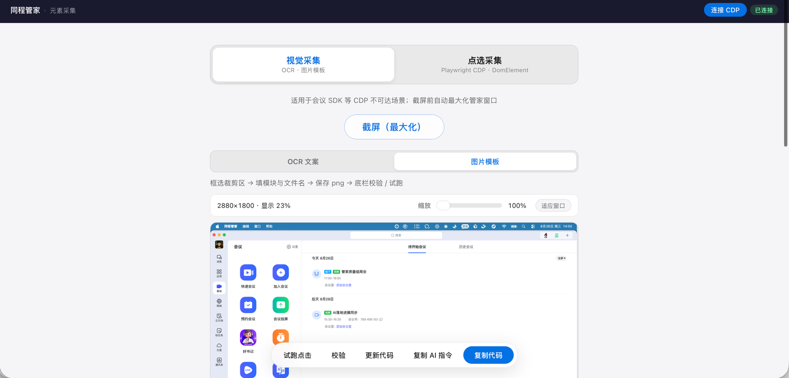
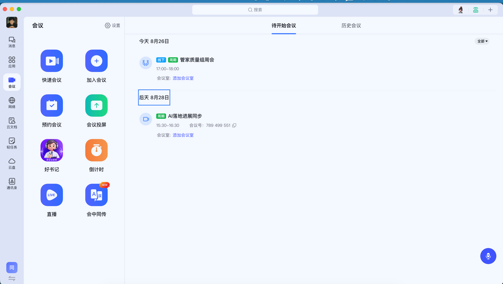
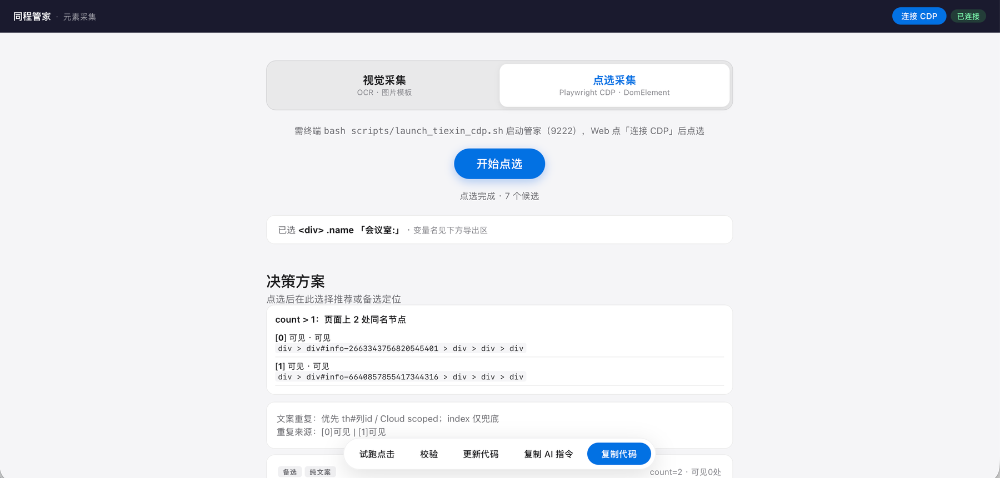
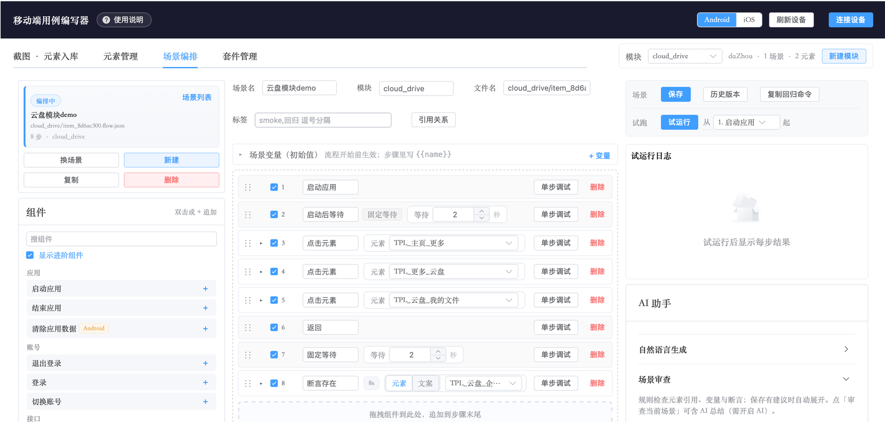
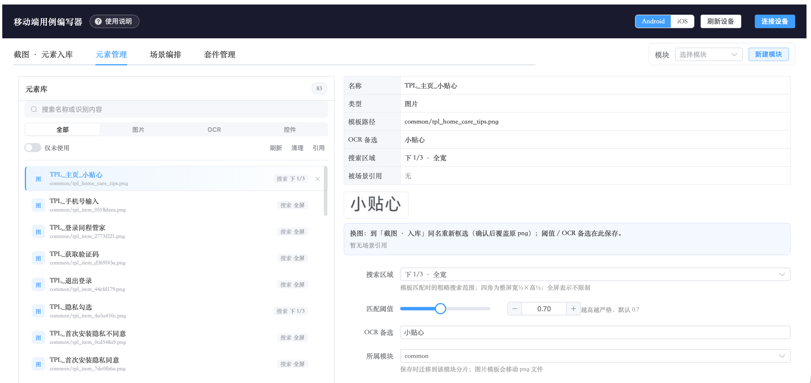
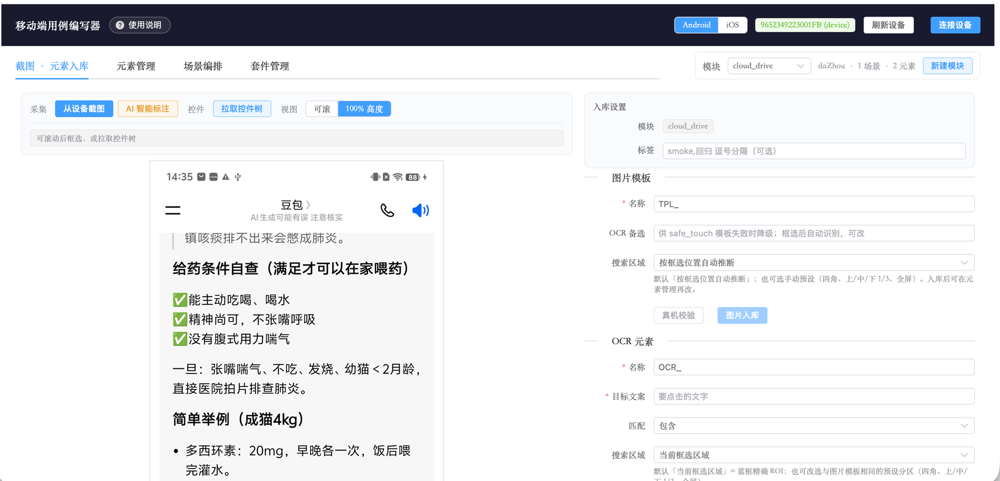
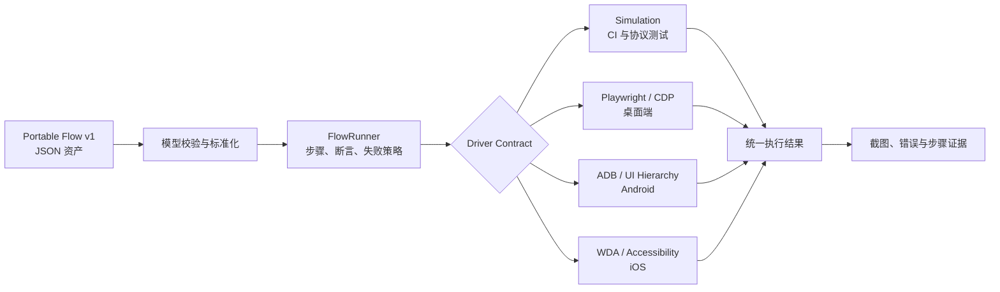

# Cross-platform Test Studio｜跨端 UI 自动化执行引擎

[English summary](#english-summary)

面向桌面端、Android 和 iOS 的统一自动化 Flow 协议与确定性执行引擎。它解决的是“一条业务场景如何跨平台复用，同时保留各端真实交互差异”，而不是把三套脚本简单拼在一起。

## 工程实践界面

以下截图展示基于同一套 Flow 思路实现的完整工程实践界面。公开仓库聚焦可复用的 Flow 协议、Runner 和平台 Driver，不包含截图中的全部可视化产品代码。

### PC 元素采集

PC 端通过 CDP 连接桌面应用或浏览器，按目标技术条件选择视觉采集或 DOM 点选采集。视觉模式支持截取最大化窗口、框选区域并生成图片模板。



点选模式直接在目标应用中选择真实元素，保留操作上下文。



当文案或结构不能唯一定位时，采集器列出候选节点和定位策略，由测试人员确认后再生成代码，避免运行时盲选。



### 场景编排

通过组件组合业务步骤，支持单步调试、断言、等待、变量、历史版本和 AI 场景审查。



### 元素资产管理

图片模板、OCR 和结构化控件统一入库，定位策略、搜索区域、阈值及引用关系作为可版本化资产维护。



### 连接设备后的采集

连接 Android 或 iOS 设备后，可从实时画面截图、拉取控件树，并将选择结果沉淀为元素资产。



## 核心设计

- 业务意图使用同一套 Portable Flow v1 表达，并以 JSON 保存，便于版本管理和评审。
- 每个操作后可以配置多个预期结果，避免把校验点错误统计成操作步骤。
- 各平台使用显式定位器和降级顺序，运行时不会让 AI 随机寻找元素。
- Runner 与 Driver 解耦，同一条 Flow 可切换模拟、Playwright、ADB 或 WDA 驱动。
- 失败时保存截图及驱动侧证据，统一生成步骤级执行结果。

## 当前已实现

- Portable Flow v1 数据模型、校验和命令行入口
- 通用 `FlowRunner`，支持执行、断言、失败策略和取消检查
- 一个操作对应多个断言
- 显式 selector fallback
- 确定性模拟驱动，适合协议测试和 CI
- Playwright 桌面端驱动及真实 Chrome CDP 冒烟示例
- ADB Android 与 WDA iOS 基础驱动接口
- 失败截图和 JSON 结果产物
- 可直接运行的 Notes Web 示例应用

> 当前公开仓库的重点是 Flow 协议和执行内核。截图中的完整拖拽式编排器、设备画面投屏及录制属于工程实践版本，并未作为公开仓库的开箱即用功能提供。

## 架构



## 快速开始

运行不依赖浏览器和设备的模拟示例：

```bash
PYTHONPATH=src python -m test_studio.cli run examples/create-note.flow.json
```

运行真实桌面端示例：

```bash
python -m http.server 4173 --directory demo
python -m venv .venv
source .venv/bin/activate
pip install -e '.[desktop]'
playwright install chromium
test-studio run examples/create-note.playwright.flow.json \
  --driver playwright \
  --base-url http://127.0.0.1:4173
```

Android 和 iOS 分别通过 `--driver adb`、`--driver wda` 选择驱动，设备标识与应用标识均在运行时传入。

## 与其他项目的关系

- [quality-ai-skills](https://github.com/linyup/quality-ai-skills)：从需求或人工用例生成 Flow 草稿。
- [device-test-lab](https://github.com/linyup/device-test-lab)：调度设备和执行 Agent，调用本项目 Runner 完成任务。

## English summary

Cross-platform Test Studio provides a versionable Flow v1 contract and deterministic runner shared by desktop, Android, and iOS automation. It supports multiple assertions per action, explicit selector fallbacks, simulation and platform drivers, and failure evidence. The current public version focuses on the execution core rather than a full visual authoring product.

## License

MIT
