# Architecture

```mermaid
flowchart LR
    S["Skill / Agent"] --> M["Optional MCP / CLI adapter"]
    M --> E["ExplorationSession"]
    E --> D["Desktop CDP / Android ADB / iOS WDA"]
    D --> R["Structured ToolResult + evidence"]
    R --> T["Reviewable trace"]
    T --> G["Draft Flow"]
    G --> H["Human review + cleanup gate"]
    H --> F["Committed Flow v1"]
    F --> X["Deterministic FlowRunner"]
```



Exploration and regression are separate execution modes. Exploration may use adaptive discovery; committed regression never invokes an LLM or silently rewrites selectors.

MCP is a transport adapter, not a second automation engine. It exposes the same Driver and `ExplorationSession` contracts used by CLI authoring, while HTTP remains the boundary for remote device scheduling and authentication. See [MCP.md](MCP.md).

The studio separates portable assets, execution policy and platform mechanics.

```text
Flow JSON -> validation -> FlowRunner -> Driver
                                      |-- Playwright desktop
                                      |-- ADB Android
                                      |-- WDA iOS
                                      `-- deterministic simulation
```

Selectors contain an ordered list of declared alternatives. Drivers may try those alternatives but must not ask a model to improvise during regression. AI assistance belongs in authoring and review, before the asset is committed.

Each failed step emits driver-specific evidence. Reports use a shared result shape so local runs and distributed agents remain interchangeable.
